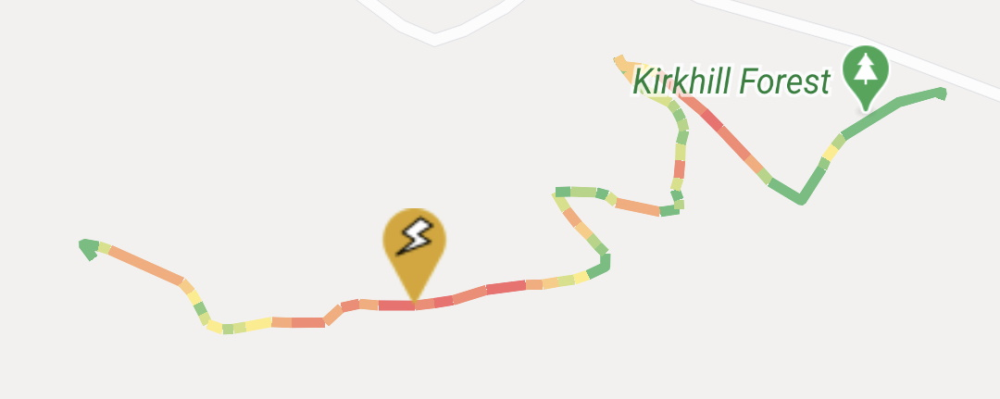
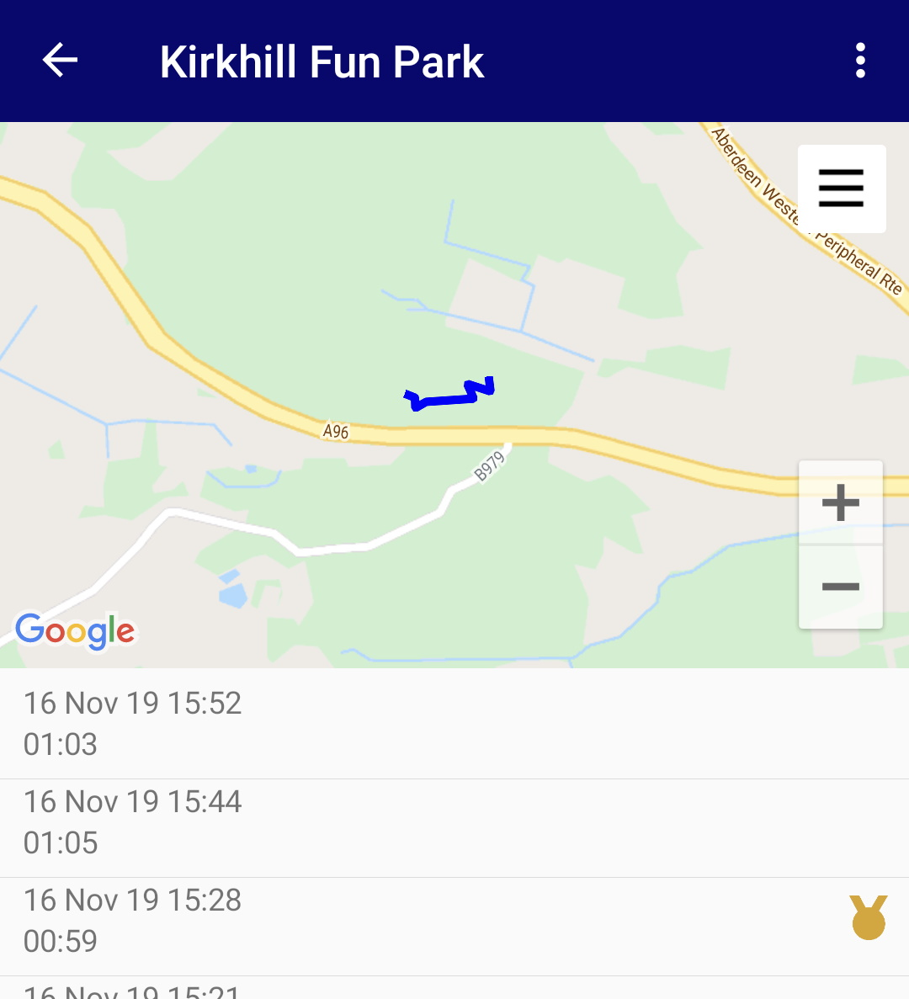
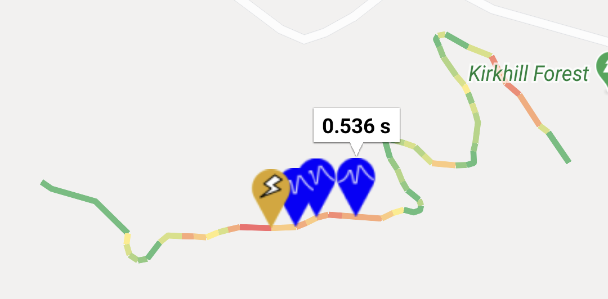

# Tracked

**Tracked** is a mountain biking android application created with Xamarin Forms. The app allows you to record your mountain biking activity such as route, speed, airtime etc. and review it within the app.

For each ride the app can record the **route**, **speed**, **jump airtimes** and **trail times**. These factors are used to create a map of the ride and provide a visual way of seeing where they can improve. You can also earn achievements for hitting certain milestones during your ride. The main features are;

### Speed Heat Map

This is the main feature of the app. It allows you to view your ride as a colour coded polyline on a map. Currently red is fastest and green is the slowest, the colours are relative to the top speed. A marker highlights the location of the top speed achieved on the ride.

### Trails (Testing)

Trails allow you to time yourself between two points and compare your results.

### Jumps & Airtime (WIP)

Tracked detects jumps using the devices accelerometer. It works by detecting when the device is in "freefall" and taking other factors into account, such as the speed. This feature is a work in progress.

I'm always on the lookout for keen mountain bikers to help test the app! If you fancy giving it a go drop me an email (details in profile) and I'll add you to the internal testers.
